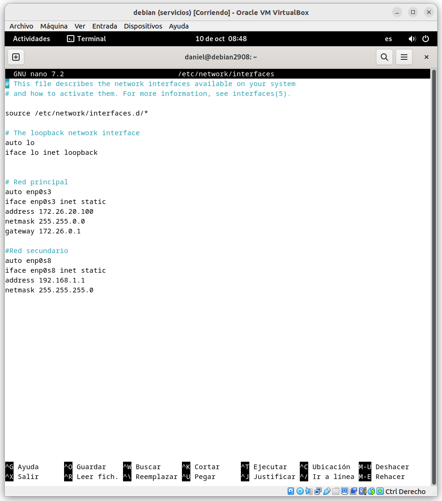
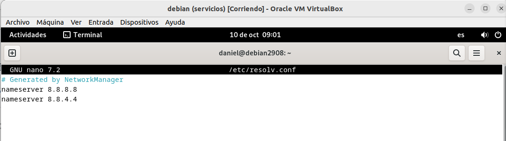
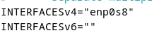
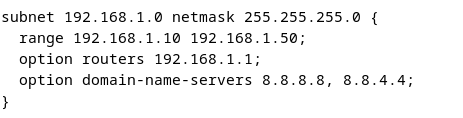
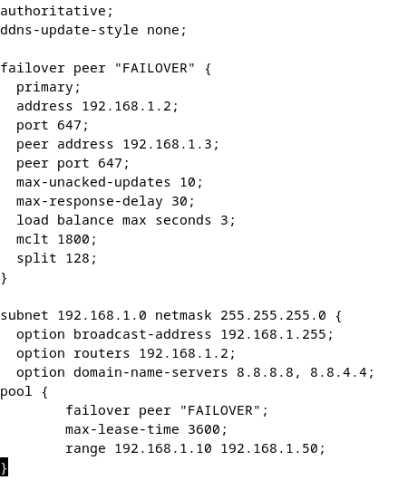
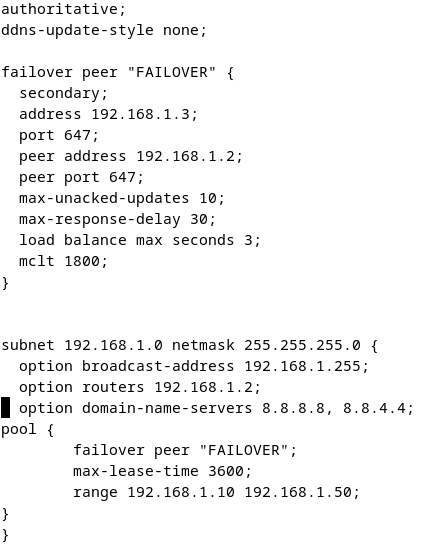
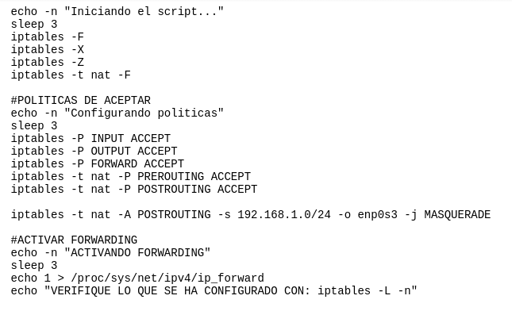
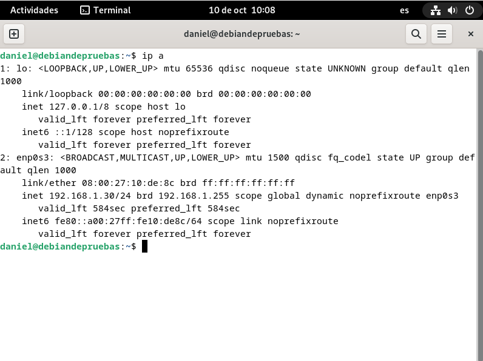
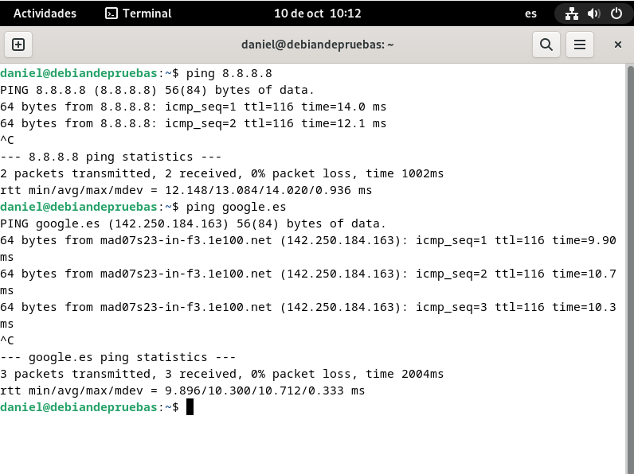

# CONFIGURACIÓN DEBIAN

Lo primero de todo es desactivar el NetworkManager, para ello ejecutaremos el comando: "systemctl disable NetworkManager" y el comando: "systemctl stop NetworkManager".

Al desactivarlo debería desaparecer el icono de conexión de la parte superior derecha.

Luego tendremos que configurar las redes desde /etc/network/interfaces, una de las tarjetas de red la tendremos en modo "Red interna", que es la tarjeta que proporcionará la IP al cliente, y la otra tarjeta de red la tendremos en modo "Adaptador puente", que deberá dar conexión ya no solo al servidor, sino también al cliente.

No viene mal cambiar los DNS desde "/etc/resolv.conf".

Ahora hacemos un "systemctl restart networking", si funciona vamos bien.

Lo que nos quedaría seria editar "/etc/default/isc-dhcp-server" y "/etc/dhcp/dhcpd.conf". 

En "/etc/default/isc-dhcp-server" ponemos el nombre de la tarjeta de red configurada como red interna en "INTERFACESv4".

Y en "/etc/dhcp/dhcpd.conf" sería configurar el dhcp.

Con la configuración actual al iniciar un cliente con la tarjeta de red en "Red interna", este le pedirá una IP dentro del rango que tenemos puesto en la imágen anterior, pero aún no tiene salida a internet.

# FAILOVER

Necesitaremos 2 servidores, la idea del Failover es tener un servidor de "repuesto", para que en caso de que el principal se caiga, tener otro que actue igual.

Para ello tendremos que configurar el Failover en "/etc/dhcp/dhcpd.conf" en los dos servidores, configurando uno como el principal y otro como el secundario.

## Principal

## Secundario

# CONEXIÓN A INTERNET

Para tener conexión haremos uso de los iptables, que su función será redireccionar el tráfico de la red desde la tarjeta con adaptador puente pasando por la tarjeta con red interna que es la que proporciona la IP al cliente.

Para ello tendremos que instalar iptables "apt install iptables" y crear un script como este:

# COMPROBACIÓN

Nos da la IP, ahora comprobar que tenga conexión a internet.

